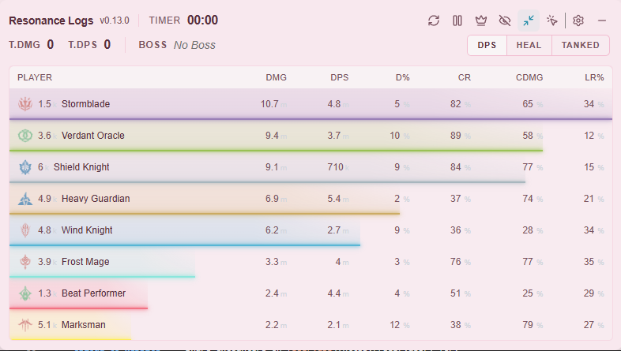

# Resonance Logs - Desktop Application

 

  
> **Live combat logging for Blue Protocol: Star Resonance**  
> **Website:** [bpsr.app](https://bpsr.app/) • **Web Platform:** [resonance-website](https://github.com/resonance-logs/resonance-website)

---

## Overview

Resonance Logs is a friendly, cross-platform desktop application designed for **Blue Protocol: Star Resonance** players who want live, actionable feedback during gameplay. Monitor your performance in real-time, track encounters, and share your achievements with the community.

### Key Features

- **Real-time Performance** - Live DPS/HPS monitoring with instant feedback
- **Encounter Tracking** - Save and review past encounters to spot improvement trends  
- **Cloud Sync** - Upload encounters to the [Resonance Website](https://github.com/resonance-logs/resonance-website) for cloud syncing and more features

---

## Quick Start

### Download & Install

1. **Visit [Releases Page](https://github.com/resonance-logs/resonance-logs/releases)**
2. **Download the latest version** for your operating system:
   - **Windows:** `.exe` installer or portable `.zip`
   - **macOS:** not supported
   - **Linux:** not supported
3. **Install and Launch** the application
4. **Connect to the game** and start tracking your encounters

---

## How It Works

### Real-Time Monitoring
- **Live DPS/HPS Display** - See your damage and healing performance in real-time
- **Moment-to-Moment Insights** - Get instant feedback on your gameplay
- **Performance Alerts** - Notifications for significant events and improvements

### Encounter Management
- **Automatic Recording** - Encounters are captured automatically during gameplay
- **Detailed Breakdown** - View damage done, healing, and key performance metrics
- **Historical Data** - Track your progress over time with saved encounters

### Community Integration
- **Upload to Website** - Share encounters on [bpsr.app](https://bpsr.app/) for:
  - Rich analytics and visualizations
  - Leaderboard competition
  - Class and build comparisons

---

## Images

---

## Tech Stack

**Core Technologies:**
  

---

## Community & Support

- **Discord:** [Join our community](https://discord.gg/aPPHe8Uq8Q)
- **Website:** [bpsr.app](https://bpsr.app/)

---

## Credits & Acknowledgments

### Foundation
- **Built from:** [winjwinj/bpsr-logs](https://github.com/winjwinj/bpsr-logs)

### Data Resources
- [PotRooms/StarResonanceData](https://github.com/PotRooms/StarResonanceData) - Blue Protocol game data
- [snoww/loa-logs](https://github.com/snoww/loa-logs) - Combat log analysis patterns
- [uwuowo.mathi.moe](http://uwuowo.mathi.moe/) - Additional game resources

---

## License

This project is licensed under the MIT License - see the [LICENSE](LICENSE) file for details.